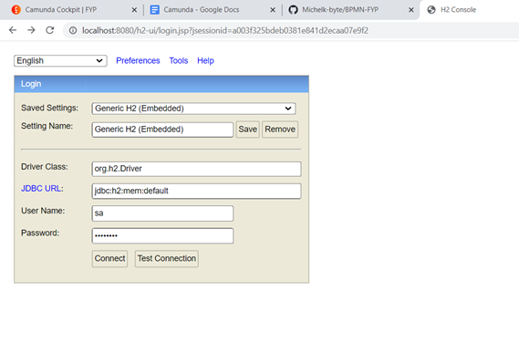
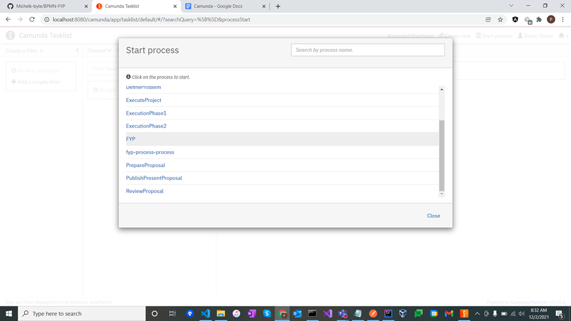
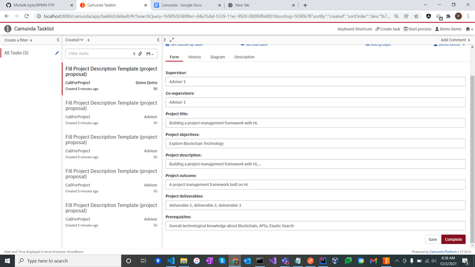
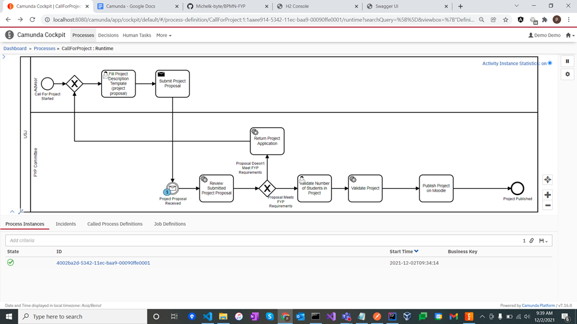
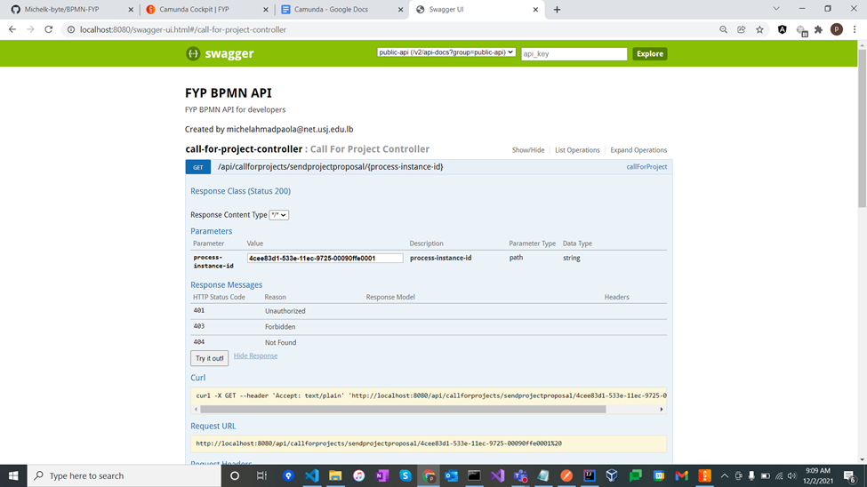
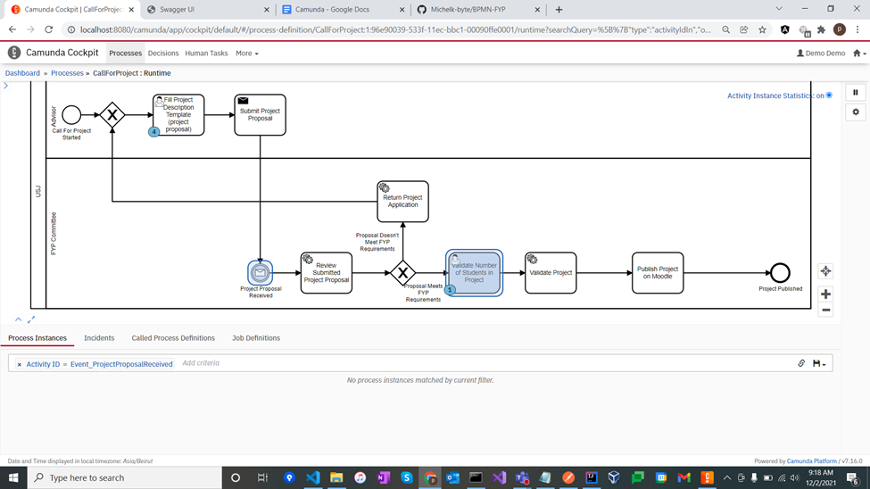
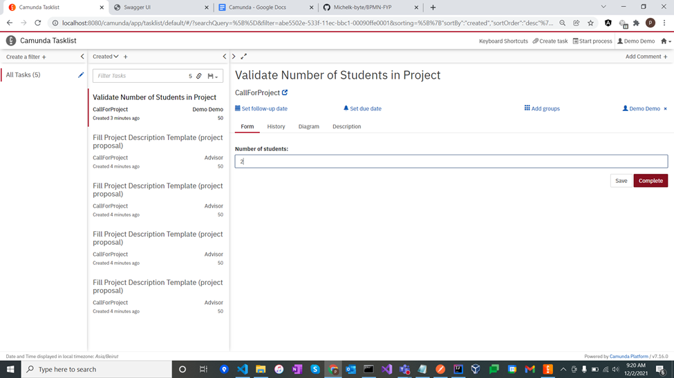
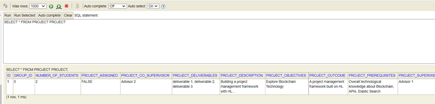
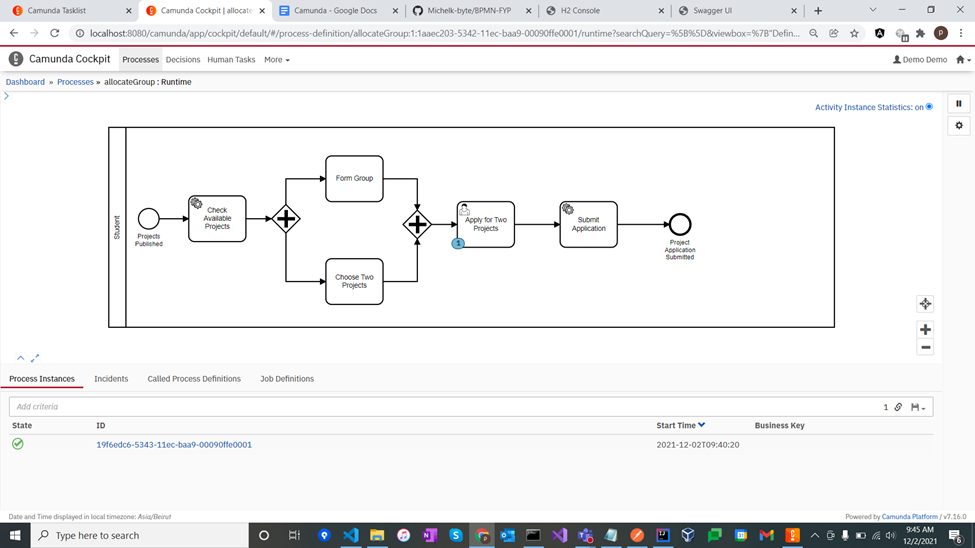
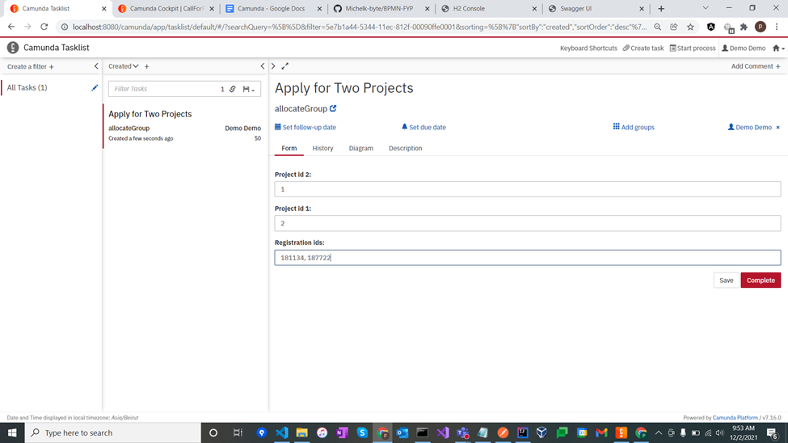

# Camunda BPM Process Application
A Mini-Project Process Application for [Camunda BPM](http://docs.camunda.org) to model and implement the FYP process.
A FYP Process is a step-by-step guide for completing our senior project. FYP is an academic task that each undergraduate student must complete individually in order to graduate with the necessary attributions.

Camunda Modeled FYP Process.

Original FYP Process to be modeled.

This project was built using Java Spring Boot functionalities such as JPA and Rest Api Controllers, as well as integrated with Camunda's various features.
Inside IntelliJ, it was set up as an Apache Maven Project. 

Spring Boot RESTful web services were documented using Swagger UI which is a set of open-source software tools that includes automated documentation, code generation, and test-case generation.

## To build the project

1. Clone the project.
2. Open Project on IntelliJ.

Due to IntelliJ's "Add Maven Support" feature, it will immediately recognize it as a maven.
Dependencies will be resolved without any user interaction.

That's it! Press Shift+F10 or click the Run button to start the project.

## To Connect to the database

Open [localhost:8080/h2-ui](http://localhost:8080/h2-ui)
Fill the following fields and connect:

**Username**: sa  
**Password**: password  
**Jdbc url**: jdbc:h2:mem:default

## To Start the project

1. To access the application, use [localhost:8080](http://localhost:8080/).
2. Authenticate with the credentials specified in application.yaml file under resources.

Default user credentials are id: demo, password: demo.

3. Click on the Home button, then TaskList, and finally Start Process.

A List of BPMN models will be provided.
4. Select the root model: "FYP".

5. Start Process. _(Business key is optional)_

6. Click on _Add Simple filters_ below create a filter to check all available tasks filtered by all assignees (Student, Advisor, FYP Committee)
7. Select one of the “Fill Project” tasks -> Reset Advisor -> Claim -> Fill the form -> Complete

8. Cockpit -> Process -> Call For Project -> Copy the process instance id

9. Open http://localhost:8080/swagger-ui.html -> Expand Call For Project -> Add the process instance id and click on Try It Out!) -> Expand Call For Project -> Add the process instance id and click on Try It Out!

10. A message will be sent to the FYP committee so that they review the project proposal, if the review passes. The process instance will be moved to the user task: “Validate Number of Students”. If the review does not pass (random), the previous tasks will have to be repeated.

11. Select “Validate Number of Students in Project” task -> Reset Advisor -> Claim -> Input the number of students -> Complete

12. Open http://localhost:8080/h2-ui
13. Find the project table and run the default query: “SELECT * FROM PROJECT PROJECT” -> You will find the newly created project.

(After the deadline, November 19th), the process instances that accomplished “Call for Project” call activity will be moved to the “Form Group And Apply for Project” call activity.

Here, the instance stops at the “Apply for Two Projects” user task. Another user input is needed as shown below.

