# Camunda BPM Process Application
A Mini-Project Process Application for [Camunda BPM](http://docs.camunda.org) to model and implement the FYP process.
A FYP Process is a step-by-step guide for completing our senior project. FYP is an academic task that each undergraduate student must complete individually in order to graduate with the necessary attributions.

## Camunda Modeled FYP Process.
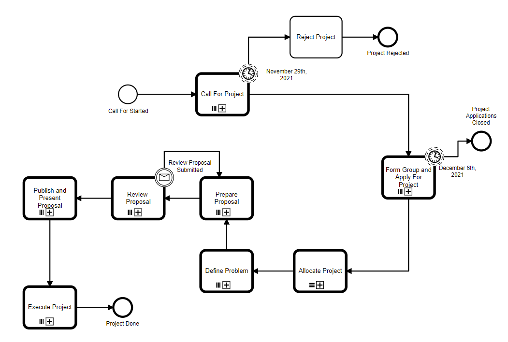

## Original FYP Process to be modeled.
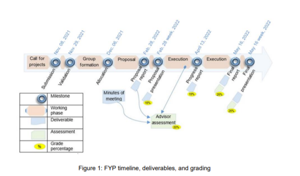

This project was built using Java Spring Boot functionalities such as JPA and Rest Api Controllers, as well as integrated with Camunda's various features.
Inside IntelliJ, it was set up as an Apache Maven Project. 

Spring Boot RESTful web services were documented using Swagger UI which is a set of open-source software tools that includes automated documentation, code generation, and test-case generation.

## Project Setup
### Build Project

1. Clone the project.
2. Open Project on IntelliJ.

Due to IntelliJ's "Add Maven Support" feature, it will immediately recognize it as a maven.
Dependencies will be resolved without any user interaction.

That's it!   
Press Shift+F10 or click the Run button to start the project.  
By default, Spring Boot uses the 8080 port number to start the embedded Tomcat server.  
Start a browser at [localhost:8080](http://localhost:8080/), and let the magic begin!

### Connect to Database

Open [localhost:8080/h2-ui](http://localhost:8080/h2-ui)
Fill the following fields and connect:

**Username**: sa  
**Password**: password  
**Jdbc url**: jdbc:h2:mem:default

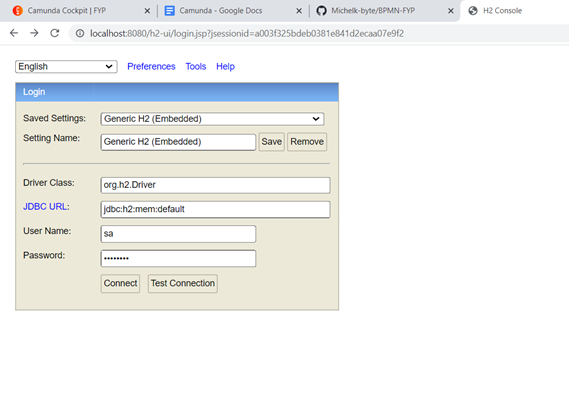

## Start Project

1. To access the application, use [localhost:8080](http://localhost:8080/).
2. Authenticate with the credentials specified in application.yaml file under resources.

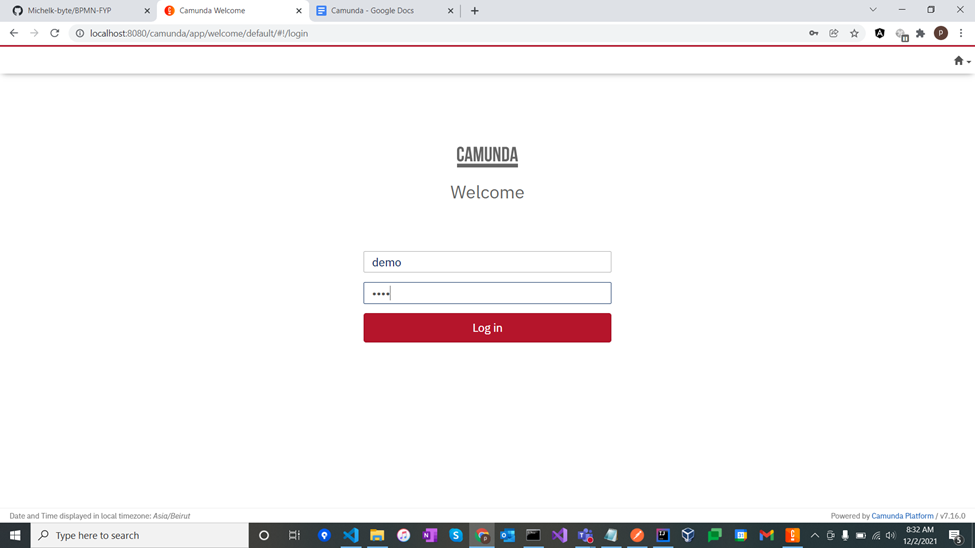

Default user credentials are id: demo, password: demo.

3. Click on the Home button, then TaskList, and finally Start Process.

A List of BPMN models will be provided.  

4. Select the root model: "FYP".

5. Start Process. _(Business key is optional)_

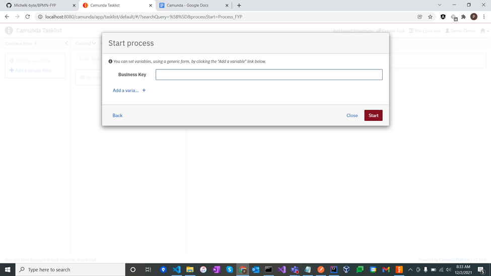

6. Click on _Add Simple filters_ below create a filter to check all available tasks filtered by all assignees (Student, Advisor, FYP Committee)
7. Select one of the “Fill Project Description Template” tasks 

This activity has been assigned to the Assignee lane because it is located within the pool's Assignee lane.

8. Reset Advisor   
9. Claim task   
10. Fill the form _(fyp project proposed template)_  
11. Complete

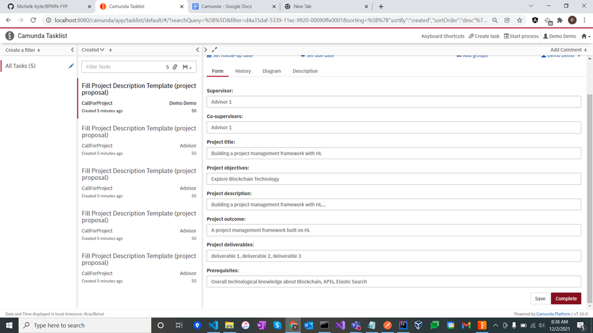

The process will resume once the task has been completed, and the token will stop at a different event or activity.

12. Go back to Cockpit 
13. Navigate to Process tab   
14. Select Call For Project subprocess 
15. Copy the process instance id under process instances tab

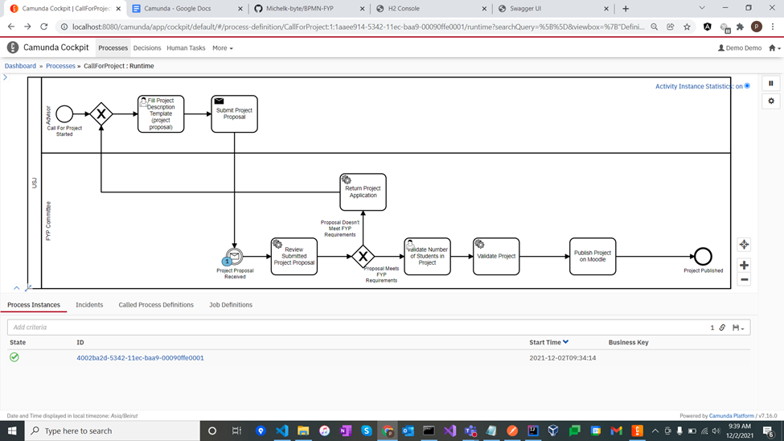

16. Open [localhost:8080/swagger-ui.html](http://localhost:8080/swagger-ui.html) 
17. Expand Call For Project Controller Endpoint 
18. Paste the process instance id 
19. Click on Try It Out!

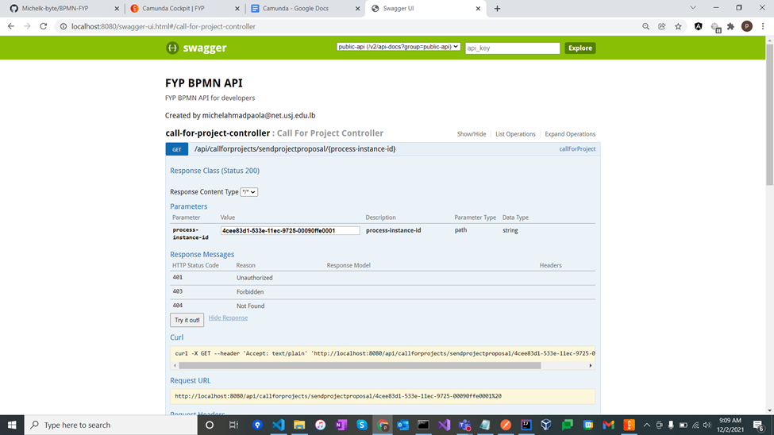

The FYP committee will be notified and asked to review the project proposal. If the review passes, the process instance will be transferred to the user task "Validate Number of Students", but if the review fails (at random), the previous tasks will have to be completed again.

In case the project proposal was reviewed successfully. 

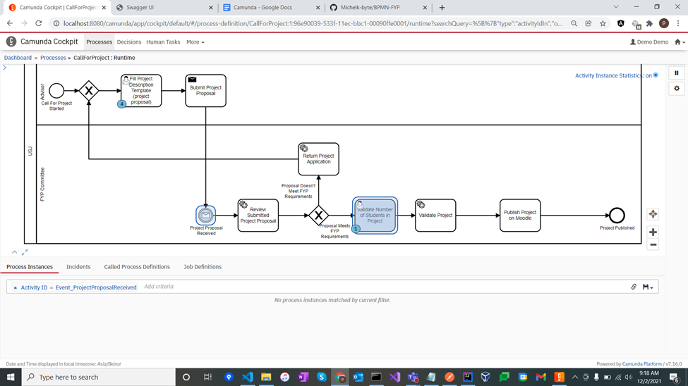

20. Select “Validate Number of Students in Project” task 
21. Reset Advisor 
22. Claim 
23. Input the number of students 
24. Complete

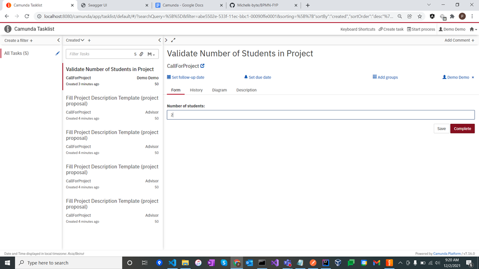

In order to locate the newly created project in the database:
25. Open [localhost:8080/h2-ui](http://localhost:8080/h2-ui)
26. Find the project table and run the default query: “SELECT * FROM PROJECT PROJECT” 

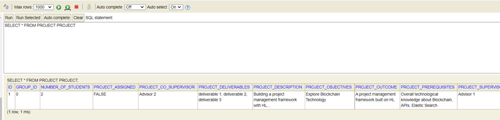

The process instances that completed the "Call for Project" call activity will be moved to the "Form Group And Apply for Project" call activity after the deadline, November 19th.

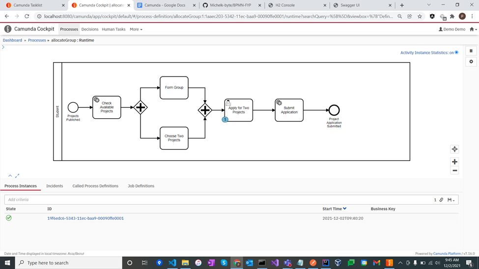

The user task "Apply for Two Projects" is where the instance comes to a halt. As shown below, additional user input is required.

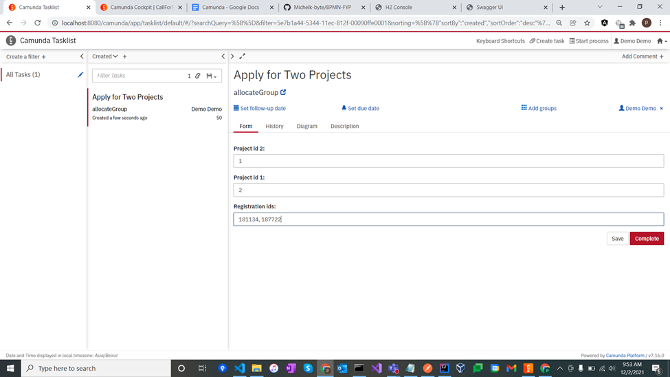

